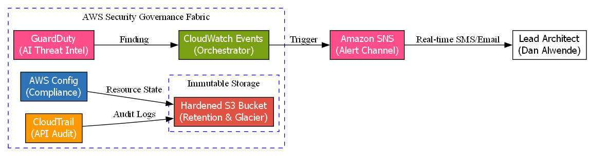
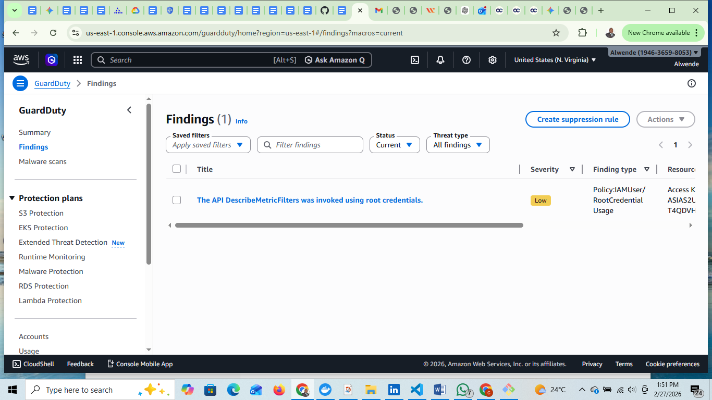
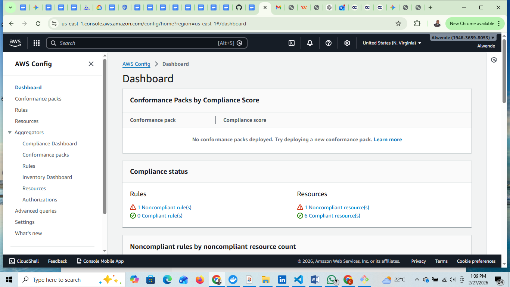
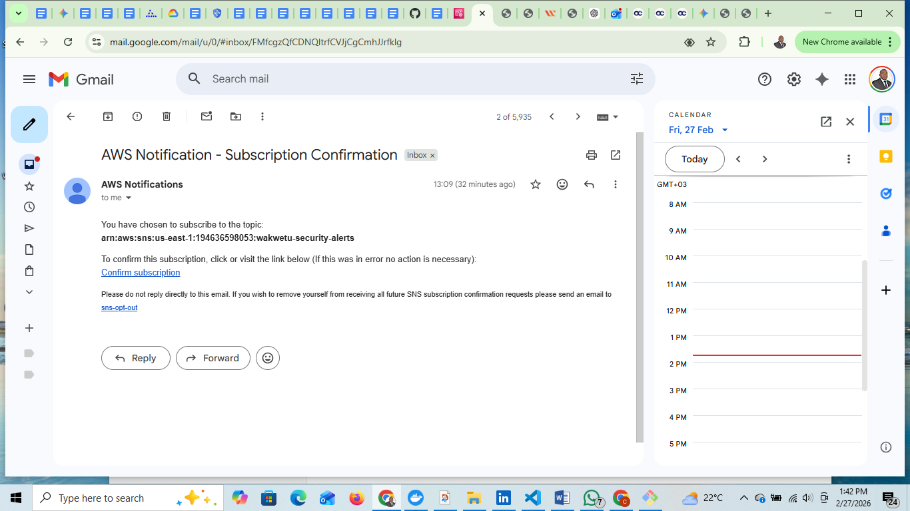

# Automated Security Governance & Sentinel (AWS)
**Lead Enterprise Solutions Architect:** Dan Alwende, PMP

## 🏗️ Project Overview
This project implements a "Security Sentinel"—an automated Governance and Threat Detection fabric. It ensures that the enterprise environment is self-auditing, compliant with CIS benchmarks, and capable of real-time incident response.

## 🏗️ Core Architecture
- **Threat Intelligence:** Amazon GuardDuty (Machine Learning based detection)
- **Continuous Compliance:** AWS Config (Resource integrity monitoring)
- **Immutable Audit:** AWS CloudTrail + Hardened S3 (Validated forensic trail)
- **Real-time Alerting:** CloudWatch Events + SNS (Instant notification)

## 🛡️ Validation & Evidence
### 1. Active Threat Detection (GuardDuty)
The system successfully identified the use of Root credentials, proving the AI-driven monitoring is live and scanning API patterns.

### 2. Continuous Compliance (AWS Config)
Real-time auditing of S3 bucket security postures. The dashboard identifies non-compliant resources for immediate remediation.

### 3. Real-time Incident Response (SNS)
Verified end-to-end notification loop from AWS to executive stakeholders.

---
*Developed for the Wakwetu Executive Project Portfolio.*
